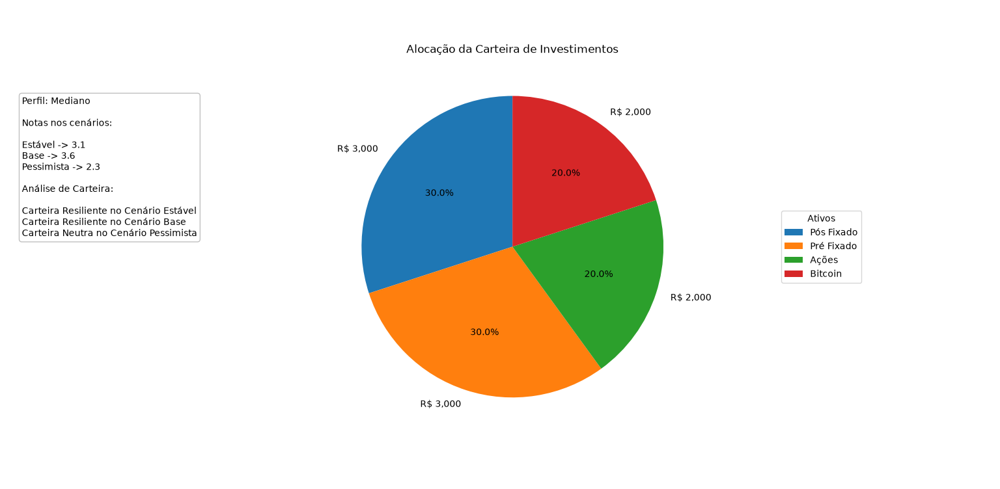

# 📊 Análise e Alocação de Carteira de Investimentos

> Ferramenta em Python para avaliar a adequação de uma carteira de investimentos a diferentes perfis de risco e cenários macroeconômicos, com foco em lógica de programação, modularização e visualização de dados.


---

## 📌 Sobre o Projeto

Este projeto simula a **alocação de patrimônio por classe de ativo** conforme o perfil do investidor (conservador, moderado, arrojado) e avalia como essa carteira se comportaria em diferentes cenários macroeconômicos (juros altos, inflação, crescimento etc.).

> ⚠️ O projeto **não realiza simulações de retorno financeiro real** — o foco é a lógica de alocação e avaliação de adequação, não previsão de rentabilidade.

Desenvolvido como exercício prático de **estruturação de código em Python**, aplicando conceitos de modularização, validação de dados e visualização com `matplotlib`.

---

## 📊 Funcionalidades

- ✅ Definição de perfis de investidor (conservador, moderado, arrojado)
- ✅ Alocação percentual por classe de ativo (renda fixa, renda variável, etc.)
- ✅ Cálculo da distribuição de patrimônio por classe
- ✅ Avaliação da carteira frente a diferentes cenários macroeconômicos
- ✅ Geração de gráfico de pizza da composição da carteira

---

## 🖼️ Exemplo de Saída



---

## 📁 Estrutura do Projeto

```bash
analise-carteira-investimentos/
│── main.py
│── README.md
│── requirements.txt
│── LICENSE
│
├── assets/
│   └── exemplo_alocacaodecarteira1.png
│
├── src/
│   │── __init__.py
│   │── carteira.py
│   └── dados.py
│
└── notebooks/
    └── analises.ipynb
```

---

## 🚀 Como Executar

1. Clone o repositório e instale as dependências:

```bash
git clone https://github.com/seu-usuario/analise-carteira-investimentos.git
cd analise-carteira-investimentos
pip install -r requirements.txt
```

2. Edite os valores em `src/dados.py` e execute o script principal:

```bash
python main.py
```

3. Ou explore de forma interativa pelo notebook:

```bash
jupyter notebook notebooks/analises.ipynb
```

---

## 📄 Licença

Este projeto está sob a licença MIT.